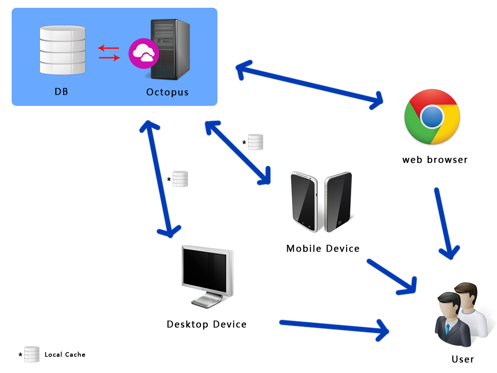

关于octopus
--------------

目标是设计成一个通用型信息管理类工具. 具有一定的可扩展性, 方便二次开发.

必备功能有:

- 用户管理, 支持外链用户或导入已有用户信息
- 权限管理, 以角色为依托, 支持到页面按钮级别颗粒度控制, 后台同时进行权限校验
- 通知管理, 支持以邮件, 短信, 客户端推送, 微信等多种形式的实时通知
- 导入导出管理, 支持用户自定义的Excel导出导出
- 纯数据化API, 支持各种客户端(web, android, ios, desktop)访问
- 任务管理, 支持任务的建立,指派,审核等操作, 结合日历后可以作为GTD管理工具
- 文件管理, 支持上传下载共享预览各种文件
- 数据图像化, 支持各种自定义数据生成可视化图形, 方便进行数据分析

